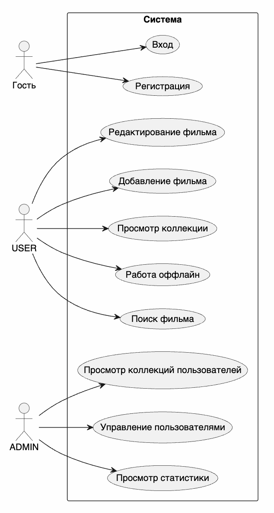

# BUC-диаграмма

BUC-диаграмма отражает основные бизнес-прецеденты проекта.

Разделение ролей важно для проекта: обычный пользователь работает только со своей коллекцией, а администратор получает отдельный набор сценариев сопровождения системы.

