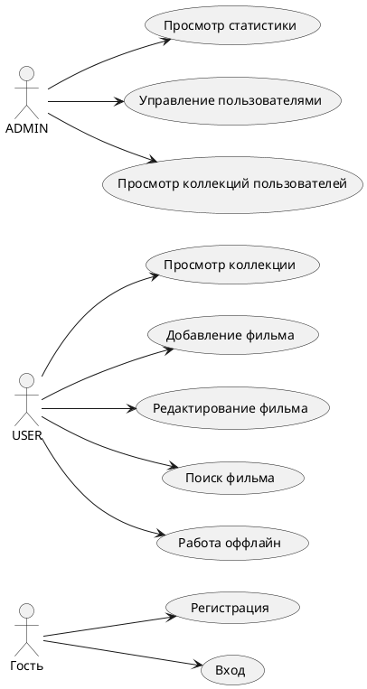

# BUC-диаграмма

BUC-диаграмма отражает основные бизнес-прецеденты проекта.

Разделение ролей важно для проекта: обычный пользователь работает только со своей коллекцией, а администратор получает отдельный набор сценариев сопровождения системы.
Гость ограничен регистрацией и входом, потому что до авторизации система не должна открывать личные данные. Пользователь выполняет основные операции с фильмами, а администратор контролирует состояние приложения через статистику, роли и просмотр коллекций.
