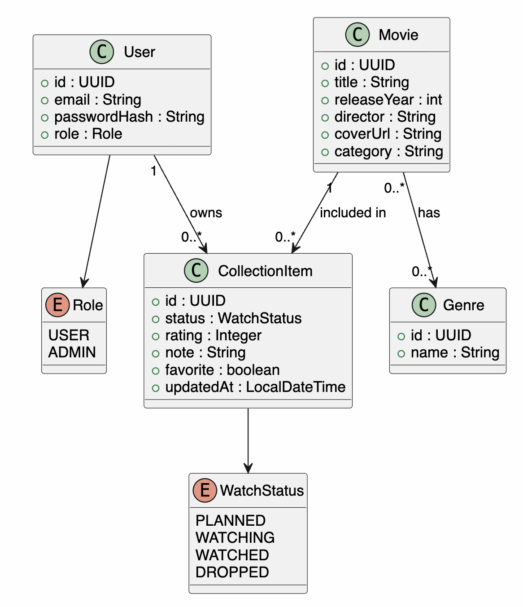

# Модель бизнес-классов

Ключевая бизнес-идея состоит в том, что фильм и запись коллекции разделены. Один фильм может встречаться у разных пользователей, но оценка, статус и заметка являются персональными.
Модель также показывает справочные перечисления `Role` и `WatchStatus`, которые ограничивают допустимые значения роли пользователя и состояния просмотра. Такая структура упрощает проверку прав доступа и исключает произвольные статусы в бизнес-логике.
