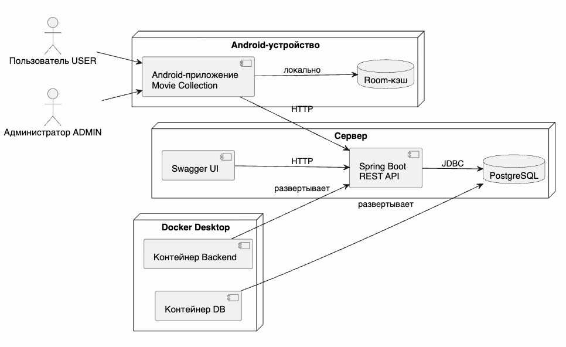

# Контекстная диаграмма

Контекстная диаграмма показывает границы системы Movie Collection и внешние сущности, с которыми она взаимодействует.

Основная граница системы включает Android-клиент, REST API, PostgreSQL и локальный Room-кэш. Android Studio, Docker Desktop, браузер и эмулятор являются средой исполнения и демонстрации.

