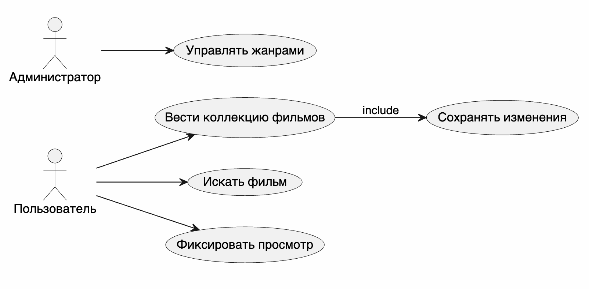

# Этап 0. Инициация и бизнес-анализ

## Паспорт проекта

| Поле | Значение |
|---|---|
| Название | Разработка мобильного приложения для ведения коллекции фильмов |
| Траектория | Мобильная |
| Автор | `Постников Илья Викторович` |
| Группа | `ПИЖ-б-о-23-1(2)` |
| Плановая длительность | 18 недель |
| Основной результат | Android-приложение и серверная часть REST API |

## Бизнес-контекст

Пользователи часто ведут списки просмотренных и запланированных к просмотру фильмов в заметках, мессенджерах или электронных таблицах. Такой способ неудобен: данные сложно фильтровать, невозможно быстро увидеть статистику, а информация не синхронизируется между устройствами.

Проект предлагает мобильное приложение для централизованного ведения личной коллекции фильмов. Система хранит карточки фильмов, жанры, статусы просмотра, оценки, заметки и обеспечивает поиск по коллекции.

## Цели проекта

- Сократить время поиска фильма в личной коллекции до 5 секунд.
- Обеспечить CRUD-операции для фильмов, жанров и записей коллекции.
- Реализовать оффлайн-доступ к последним загруженным данным.
- Обеспечить безопасный доступ через регистрацию, вход и JWT.

## Стейкхолдеры

| Стейкхолдер | Интерес | Влияние |
|---|---|---|
| Пользователь | Ведение личной коллекции, поиск, фильтрация | Высокое |
| Администратор | Управление учетными записями, ролями и коллекциями пользователей | Среднее |
| Разработчик | Поддерживаемая архитектура и тестируемость | Высокое |
| Преподаватель | Соответствие методическим требованиям | Высокое |

## Бизнес-глоссарий

| Термин | Определение |
|---|---|
| Фильм | Аудиовизуальное произведение, добавляемое в коллекцию |
| Коллекция | Персональный набор фильмов пользователя |
| Карточка фильма | Структурированное описание фильма |
| Статус просмотра | Значение `запланирован`, `смотрю`, `просмотрен`, `брошен` |
| Оценка | Пользовательская оценка фильма от 1 до 10 |
| Жанр | Категория фильма, например драма или фантастика |
| Заметка | Личный текстовый комментарий пользователя |
| Избранное | Подмножество фильмов, отмеченных пользователем |
| Оффлайн-режим | Работа с кэшированными данными без сети |
| REST API | Интерфейс обмена данными между клиентом и сервером |
| JWT | Токен для аутентификации пользователя |
| Роль | Набор прав пользователя |
| Администратор | Пользователь с правами просмотра статистики и управления учетными записями |
| Поиск | Получение фильмов по строке и фильтрам |
| Синхронизация | Обновление локального кэша по данным сервера |

## SWOT-анализ

| Сторона | Содержание |
|---|---|
| Strengths | Мобильный доступ, быстрый поиск, персональные статусы и оценки |
| Weaknesses | Зависимость от качества заполнения карточек пользователем |
| Opportunities | Рекомендации, импорт из внешних каталогов, совместные коллекции |
| Threats | Потеря интереса пользователя, конкуренция с крупными каталогами |

## Бизнес-прецеденты

Диаграмма бизнес-прецедентов показывает основные действия в системе на уровне бизнес-процессов. Пользователь ведет коллекцию, ищет фильмы и фиксирует просмотр, а администратор контролирует учетные записи, роли и общую статистику.

## Модель бизнес-классов

Модель бизнес-классов отражает предметные сущности проекта: пользователя, фильм, запись коллекции, категорию, роль и статус просмотра. Разделение `Movie` и `CollectionItem` важно, потому что один и тот же фильм может быть в коллекциях разных пользователей с разными оценками, статусами и заметками.

## Экономическое обоснование

| Показатель | Значение |
|---|---|
| Оценка трудозатрат | 180 часов |
| Средняя ставка учебной разработки | 350 руб./час |
| Условная стоимость разработки | 63 000 руб. |
| Экономия времени пользователя | 2 часа в месяц |
| Окупаемость учебного прототипа | Демонстрационная, через повышение удобства учета |
