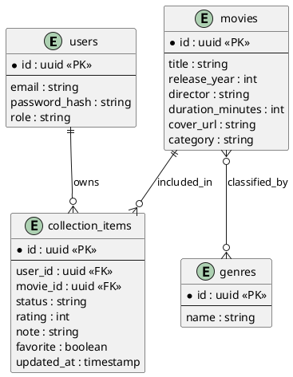

# Модель предметной области

Модель учитывает многопользовательскую природу приложения. Таблица `collection_items` позволяет хранить разные статусы и оценки одного фильма у разных пользователей.
Связь `users` и `movies` выполнена через промежуточную сущность, потому что пользовательские поля не относятся к самому фильму глобально. Благодаря этому два пользователя могут добавить один и тот же фильм, но хранить разные оценки, заметки и статусы просмотра.
