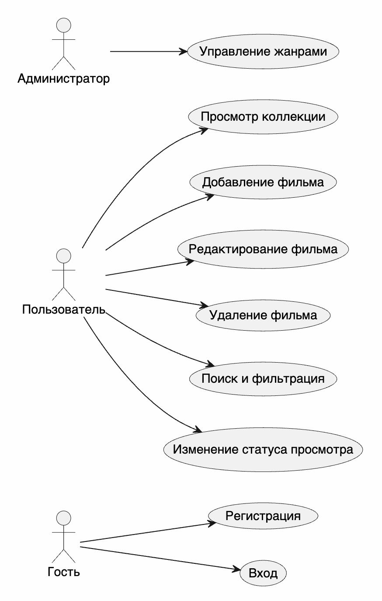
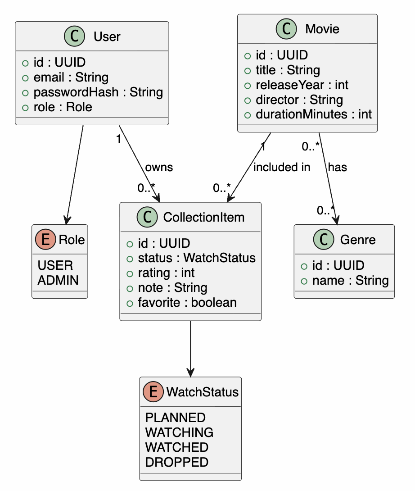

# Этап 1. Проектирование требований

## Акторы

| Актор | Описание |
|---|---|
| Гость | Может зарегистрироваться или войти |
| Пользователь | Ведет личную коллекцию фильмов |
| Администратор | Управляет учетными записями, ролями, статистикой и коллекциями пользователей |

## Функциональные требования

| ID | Требование | Приоритет |
|---|---|---|
| FR-01 | Система должна позволять пользователю зарегистрироваться | Must |
| FR-02 | Система должна выполнять вход по email и паролю | Must |
| FR-03 | Система должна отображать список фильмов коллекции | Must |
| FR-04 | Система должна позволять создать карточку фильма | Must |
| FR-05 | Система должна позволять редактировать карточку фильма | Must |
| FR-06 | Система должна позволять удалить фильм из коллекции | Must |
| FR-07 | Система должна поддерживать поиск и фильтрацию | Must |
| FR-08 | Система должна сохранять статус просмотра | Must |
| FR-09 | Система должна сохранять оценку и заметку | Should |
| FR-10 | Система должна кэшировать данные для оффлайн-режима | Must |
| FR-11 | Администратор должен управлять учетными записями, ролями и коллекциями пользователей | Should |
| FR-12 | Система должна документировать REST API через OpenAPI | Must |

## Нефункциональные требования

| ID | Требование |
|---|---|
| NFR-01 | Время загрузки списка фильмов при нормальной сети — до 2 секунд |
| NFR-02 | Пароли должны храниться только в виде BCrypt-хэша |
| NFR-03 | REST API должно использовать JWT-аутентификацию |
| NFR-04 | Архитектура должна соответствовать PCMEF |
| NFR-05 | Покрытие модульными тестами должно быть выше 40% |
| NFR-06 | Интерфейс должен соответствовать Material Design |

## Use Case диаграмма

## Спецификация Use Case: добавление фильма

| Поле | Описание |
|---|---|
| ID | UC-01 |
| Название | Добавление фильма в коллекцию |
| Актор | Пользователь |
| Предусловие | Пользователь авторизован |
| Основной сценарий | Пользователь открывает форму, вводит название, год, жанры, статус, оценку и сохраняет карточку |
| Альтернативный сценарий | При ошибках валидации система показывает подсказки |
| Постусловие | Фильм сохранен на сервере и в локальном кэше |

## Спецификация Use Case: поиск фильма

| Поле | Описание |
|---|---|
| ID | UC-02 |
| Название | Поиск фильма в коллекции |
| Актор | Пользователь |
| Предусловие | В коллекции есть фильмы |
| Основной сценарий | Пользователь вводит строку поиска и выбирает фильтры, система показывает подходящие фильмы |
| Альтернативный сценарий | Если сеть недоступна, поиск выполняется по локальному кэшу |
| Постусловие | Пользователь видит найденные фильмы или пустое состояние |

## Domain Model

## Таблица трассировки

| Бизнес-потребность | Требование | Use Case |
|---|---|---|
| Удобно вести коллекцию | FR-03, FR-04, FR-05, FR-06 | UC-01 |
| Быстро находить фильм | FR-07 | UC-02 |
| Работать без сети | FR-10 | UC-02 |
| Защитить личные данные | FR-01, FR-02, NFR-02, NFR-03 | Вход и регистрация |
