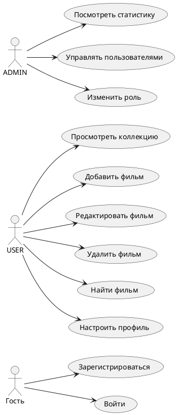

# Диаграмма вариантов использования

Диаграмма фиксирует функциональные границы приложения с точки зрения трех акторов: гостя, обычного пользователя и администратора. Она показывает, что административные возможности не смешиваются с пользовательским сценарием ведения коллекции, а доступны только роли `ADMIN`.
