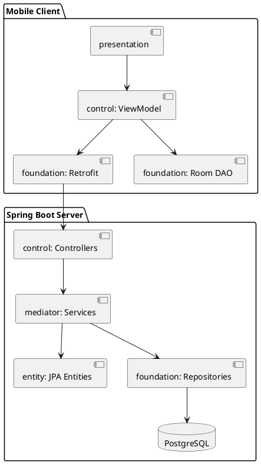
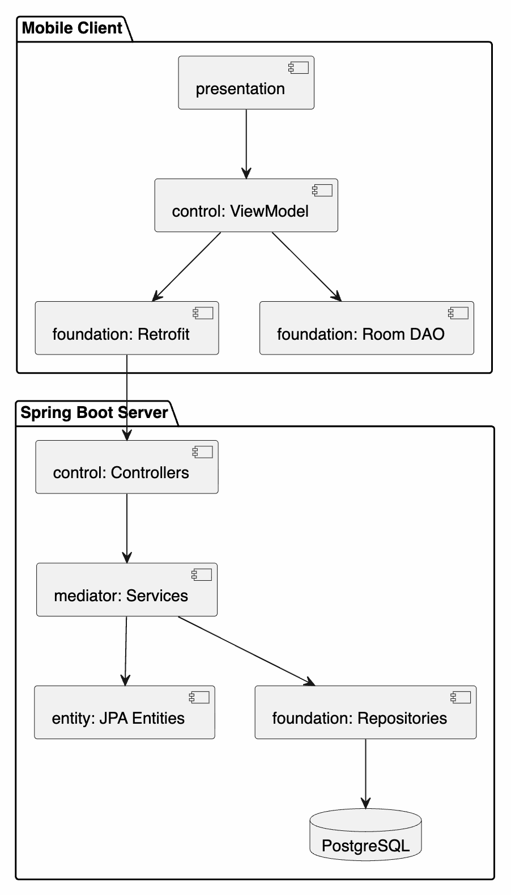

# Этап 2. Архитектурное проектирование

## Обоснование PCMEF

PCMEF выбран как базовый архитектурный паттерн, потому что проект содержит мобильный интерфейс, серверную бизнес-логику, предметные сущности и два уровня хранения данных: PostgreSQL на сервере и Room-кэш на клиенте. Разделение на Presentation, Control, Mediator, Entity и Foundation снижает связность и позволяет тестировать бизнес-логику отдельно от UI и инфраструктуры.

## Распределение слоев

| Слой | Мобильный клиент | Сервер |
|---|---|---|
| Presentation | Compose screens | Swagger UI |
| Control | ViewModel, UI state | REST Controllers |
| Mediator | Не содержит бизнес-правил сервера | Services |
| Entity | UI models, DTO | JPA entities |
| Foundation | Retrofit, Room DAO | Spring Data repositories |

## Диаграмма пакетов





Диаграмма пакетов показывает физическое распределение кода по клиентской и серверной частям. Android-приложение содержит UI, ViewModel, сетевой слой и Room, а backend разделен на контроллеры, сервисы, сущности и репозитории.

## Интерфейсы между слоями

### Control → Mediator

```java
public interface MovieService {
    MovieDto createMovie(UUID userId, CreateMovieCommand command);
    MovieDto updateMovie(UUID userId, UUID movieId, CreateMovieCommand command);
    MovieDto getMovie(UUID userId, UUID movieId);
    List<MovieDto> search(UUID userId, String query, WatchStatus status);
    MovieDto changeStatus(UUID userId, UUID movieId, WatchStatus status);
    void deleteFromCollection(UUID userId, UUID movieId);
}
```

### Mediator → Foundation

```java
public interface MovieRepository {
    Optional<Movie> findById(UUID movieId);
    Movie save(Movie movie);
    void delete(Movie movie);
}
```

```java
public interface CollectionItemRepository {
    List<CollectionItem> findByOwnerIdOrderByMovieTitle(UUID ownerId);
    List<CollectionItem> findByOwnerIdAndStatusOrderByMovieTitle(UUID ownerId, WatchStatus status);
    Optional<CollectionItem> findByOwnerIdAndMovieId(UUID ownerId, UUID movieId);
}
```

## ADR-001. Выбор Android Native

| Поле | Решение |
|---|---|
| Контекст | Требуется мобильное приложение с оффлайн-кэшем и Material Design |
| Решение | Использовать Kotlin, Jetpack Compose, ViewModel, StateFlow, Retrofit и Room |
| Последствия | Клиент соответствует требованиям мобильной траектории и хорошо демонстрирует обработку состояний |

## ADR-002. Выбор Spring Boot

| Поле | Решение |
|---|---|
| Контекст | Методичка требует Java + Spring Boot сервер для мобильной траектории |
| Решение | Использовать Spring Boot 3, Spring Security, Spring Data JPA |
| Последствия | REST API, JWT и работа с PostgreSQL реализуются стандартными средствами |

## Проверка зависимостей

Зависимости направлены сверху вниз:

```text
Presentation → Control → Mediator → Entity/Foundation
```

Foundation не зависит от Presentation, а Entity не зависит от UI и инфраструктурных классов.
