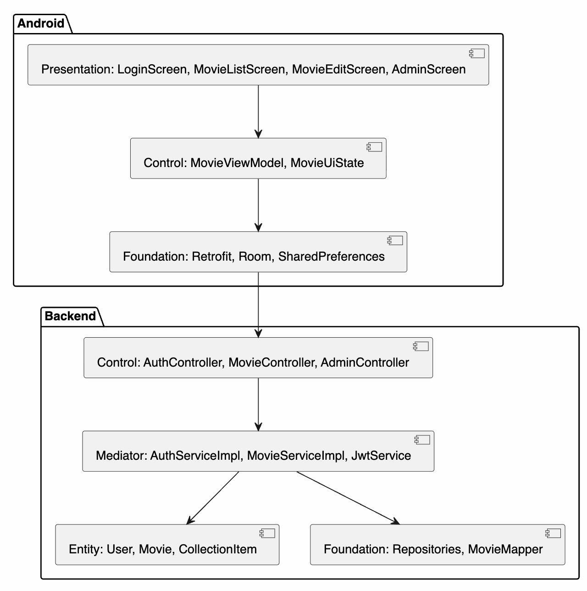

# PCMEF-диаграмма

PCMEF выбран как понятная учебная структура: Presentation отвечает за UI, Control за обработку пользовательских действий, Mediator за бизнес-логику, Entity за предметную модель, Foundation за доступ к данным.
