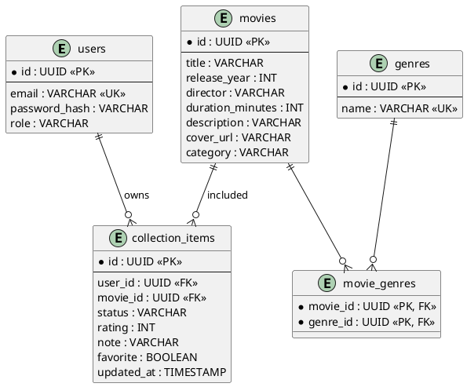

# Этап 3. Проектирование базы данных

## Сущности базы данных

| Таблица | Назначение |
|---|---|
| users | Пользователи системы |
| movies | Фильмы |
| genres | Жанры |
| movie_genres | Связь многие-ко-многим между фильмами и жанрами |
| collection_items | Записи личной коллекции |

## ER-диаграмма




ER-диаграмма фиксирует основную схему PostgreSQL. Центральная таблица `collection_items` связывает пользователя и фильм и хранит пользовательские параметры просмотра, поэтому сама таблица `movies` остается общей карточкой фильма.

## DDL-скрипт

```sql
CREATE TABLE users (
    id UUID PRIMARY KEY,
    email VARCHAR(255) NOT NULL UNIQUE,
    password_hash VARCHAR(255) NOT NULL,
    role VARCHAR(20) NOT NULL CHECK (role IN ('USER', 'ADMIN')),
    created_at TIMESTAMP NOT NULL DEFAULT CURRENT_TIMESTAMP
);

CREATE TABLE movies (
    id UUID PRIMARY KEY,
    title VARCHAR(255) NOT NULL,
    release_year INT CHECK (release_year BETWEEN 1888 AND 2100),
    director VARCHAR(255),
    duration_minutes INT CHECK (duration_minutes > 0),
    description TEXT
);

CREATE TABLE genres (
    id UUID PRIMARY KEY,
    name VARCHAR(100) NOT NULL UNIQUE
);

CREATE TABLE movie_genres (
    movie_id UUID NOT NULL REFERENCES movies(id) ON DELETE CASCADE,
    genre_id UUID NOT NULL REFERENCES genres(id) ON DELETE RESTRICT,
    PRIMARY KEY (movie_id, genre_id)
);

CREATE TABLE collection_items (
    id UUID PRIMARY KEY,
    user_id UUID NOT NULL REFERENCES users(id) ON DELETE CASCADE,
    movie_id UUID NOT NULL REFERENCES movies(id) ON DELETE CASCADE,
    status VARCHAR(30) NOT NULL CHECK (status IN ('PLANNED', 'WATCHING', 'WATCHED', 'DROPPED')),
    rating INT CHECK (rating BETWEEN 1 AND 10),
    note TEXT,
    favorite BOOLEAN NOT NULL DEFAULT FALSE,
    updated_at TIMESTAMP NOT NULL DEFAULT CURRENT_TIMESTAMP,
    UNIQUE (user_id, movie_id)
);

CREATE INDEX idx_movies_title ON movies(title);
CREATE INDEX idx_collection_user_status ON collection_items(user_id, status);
```

## ORM-стратегия

JPA-сущности располагаются в слое `entity`. Репозитории Spring Data JPA располагаются в слое `foundation`. Для передачи данных наружу используются DTO и Data Mapper, чтобы REST-контроллеры не отдавали JPA-сущности напрямую.
