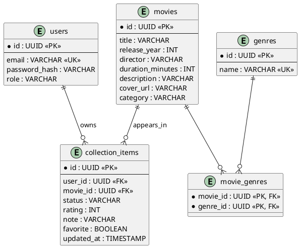
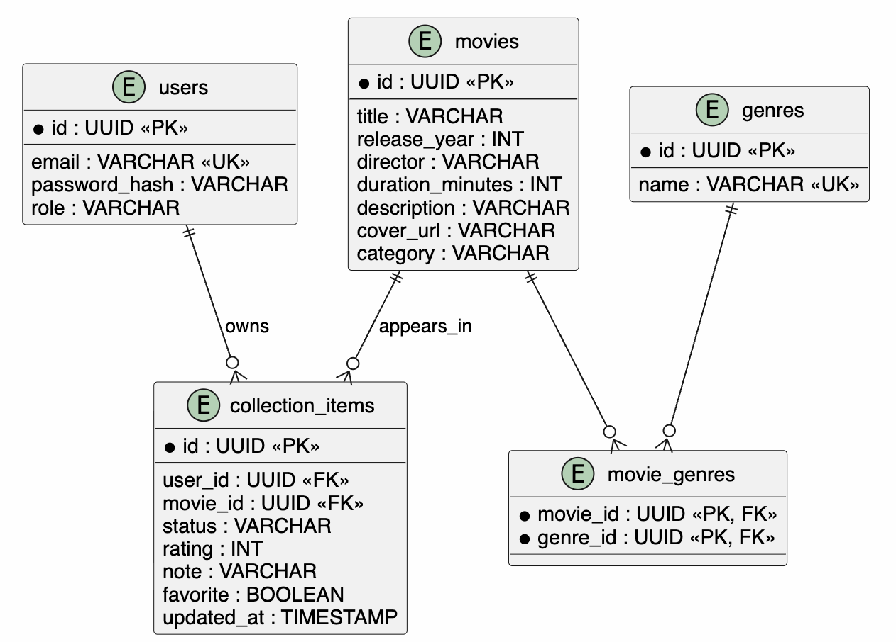

# ER-диаграмма

Ограничение `UNIQUE (user_id, movie_id)` запрещает добавлять один и тот же фильм в коллекцию одного пользователя дважды.
ER-диаграмма показывает, что серверная база данных хранит не только фильмы, но и персональную связь пользователя с фильмом. Именно таблица `collection_items` содержит статус просмотра, оценку, заметку и признак избранного.
