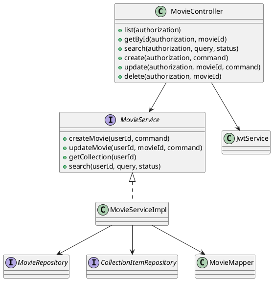

# Диаграмма проектных классов

Диаграмма отражает основной backend-сценарий работы с фильмами. REST-контроллер принимает запрос, извлекает пользователя из JWT и передает выполнение сервису.
Класс `MovieServiceImpl` является центром бизнес-логики: он проверяет принадлежность фильма пользователю, обновляет сущности и возвращает DTO через `MovieMapper`. Репозитории остаются инфраструктурным слоем и не используются напрямую из контроллера.
