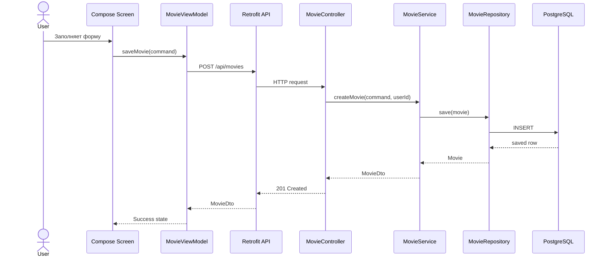
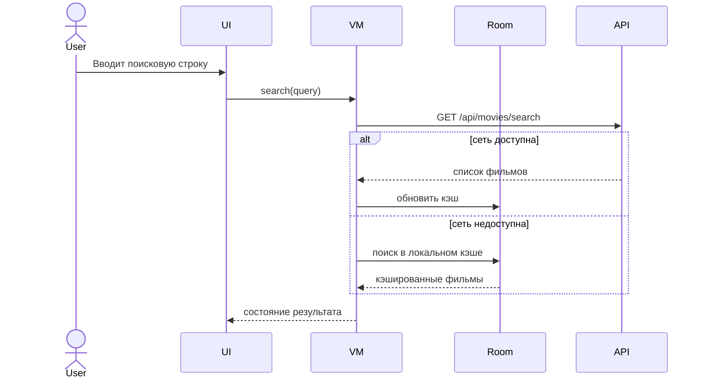

# Этап 4. Детальное проектирование

## Диаграмма последовательности: добавление фильма

## Диаграмма последовательности: поиск

## Ключевые классы

| Класс | Слой | Назначение |
|---|---|---|
| MovieListScreen | Presentation | Отображает список фильмов |
| MovieViewModel | Control | Управляет состоянием UI |
| MovieController | Control | REST API для фильмов |
| MovieServiceImpl | Mediator | Бизнес-логика фильмов |
| Movie | Entity | Сущность фильма |
| CollectionItem | Entity | Запись коллекции пользователя |
| MovieRepository | Foundation | Доступ к фильмам |
| MovieMapper | Foundation/Mediator boundary | Преобразует Entity в DTO |

## Спецификация методов

| Метод | Назначение | Ошибки |
|---|---|---|
| `createMovie(command, userId)` | Создает фильм и добавляет его в коллекцию | 400 при ошибке валидации |
| `updateMovie(movieId, command, userId)` | Обновляет карточку фильма пользователя | 404 если фильм не найден |
| `searchMovies(query, userId)` | Ищет фильмы по строке и фильтрам | Возвращает пустой список |
| `changeStatus(movieId, status, userId)` | Меняет статус просмотра | 403 при чужой записи |

