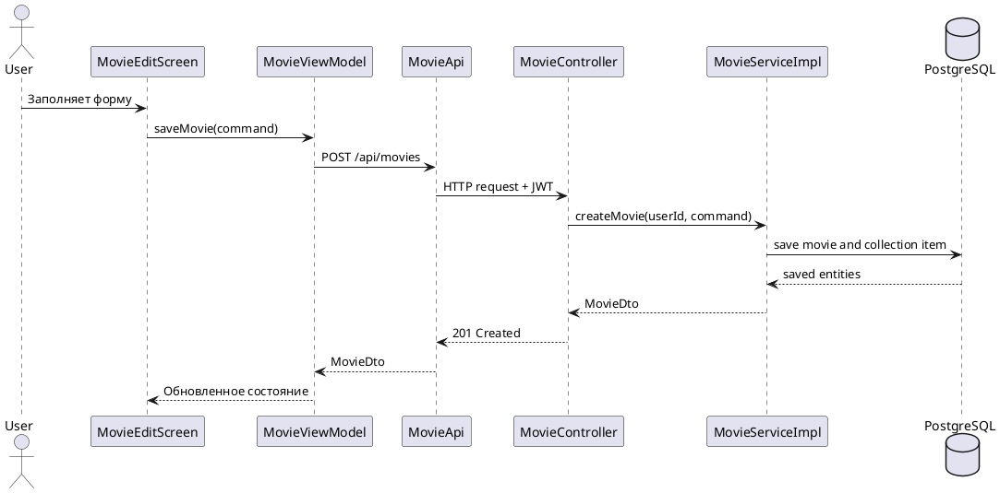
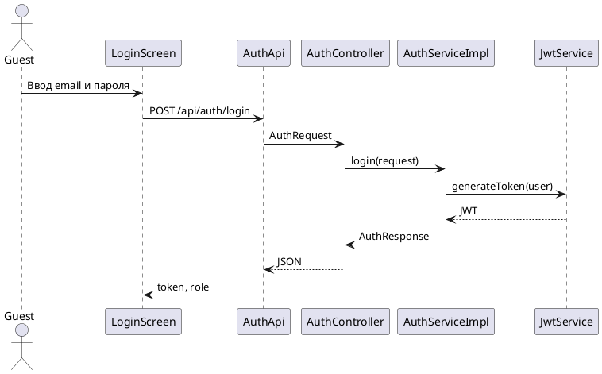
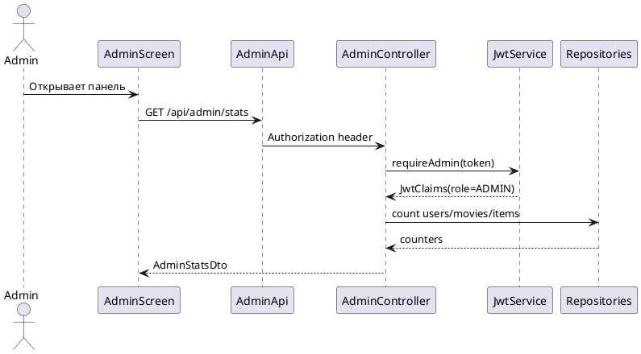

# Диаграммы последовательностей

## Создание фильма

Сценарий показывает полный путь создания карточки: от формы Android-приложения до сохранения данных в PostgreSQL. Важный момент состоит в том, что клиент передает JWT, а backend определяет владельца коллекции по токену, а не доверяет пользовательскому вводу.

## Вход пользователя

Диаграмма авторизации показывает, как email и пароль обрабатываются backend-сервисом. После успешной проверки пароль больше не передается, а мобильное приложение использует JWT для последующих запросов.

## Просмотр админки

Административный сценарий начинается с проверки роли через `JwtService.requireAdmin`. Если токен не принадлежит пользователю с ролью `ADMIN`, backend не должен отдавать статистику или список учетных записей.
