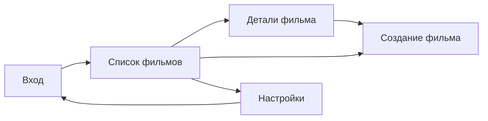

# Этап 8. Пользовательский интерфейс

## Обязательные экраны

| Экран | Назначение | Файл скриншота |
|---|---|---|
| Вход/регистрация | Авторизация пользователя | `docs/images/ui-login.png` |
| Список фильмов | Основной экран коллекции | `docs/images/ui-movie-list.png` |
| Детали фильма | Просмотр полной карточки | `docs/images/ui-movie-details.png` |
| Создание/редактирование | Форма изменения фильма | `docs/images/ui-movie-edit.png` |
| Настройки/профиль | Данные пользователя и выход | `docs/images/ui-settings.png` |

## Навигация

## Состояния списка

| Состояние | Поведение |
|---|---|
| Loading | Показывается индикатор загрузки |
| Empty | Показывается сообщение `Коллекция пока пуста` |
| Success | Показывается список карточек фильмов |
| Error | Показывается текст ошибки и кнопка повтора |
| Offline | Показывается баннер `Данные загружены из кэша` |

## Требования UX

- На карточке фильма отображаются название, год, жанры, статус и оценка.
- Основная кнопка добавления фильма доступна с экрана списка.
- Фильтры не должны перекрывать список на маленьком экране.
- Ошибки ввода показываются рядом с соответствующим полем.
- Удаление требует подтверждения.

