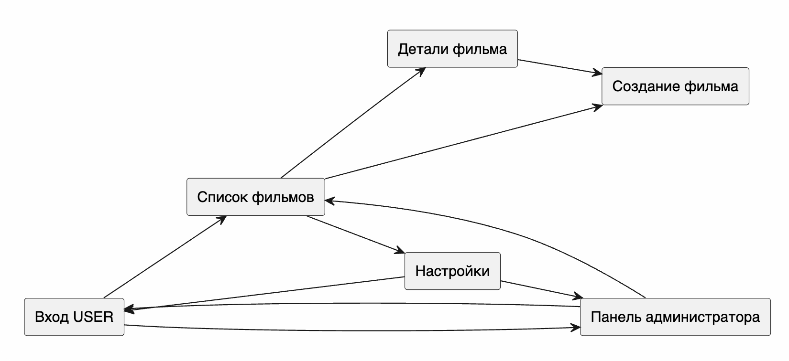

# Этап 8. Пользовательский интерфейс

## Обязательные экраны

| Экран | Назначение | Файл скриншота |
|---|---|---|
| Вход/регистрация | Авторизация пользователя | `docs/images/ui-login.png` |
| Список фильмов | Основной экран коллекции | `docs/images/ui-movie-list.png` |
| Детали фильма | Просмотр полной карточки | `docs/images/ui-movie-details.png` |
| Создание/редактирование | Форма изменения фильма | `docs/images/ui-movie-edit.png` |
| Настройки/профиль | Данные пользователя и выход | `docs/images/ui-settings.png` |
| Панель администратора | Управление учетными записями, ролями и коллекциями пользователей | `docs/images/ui-admin.png` |

## Навигация

## Разделение ролей

| Роль | Стартовый экран после входа | Доступные действия |
|---|---|---|
| USER | Список фильмов | Ведение личной коллекции: добавление, редактирование, удаление, поиск и фильтрация фильмов |
| ADMIN | Панель администратора | Просмотр статистики, списка учетных записей, коллекций пользователей, изменение ролей и удаление пользователей |

## Состояния списка

| Состояние | Поведение |
|---|---|
| Loading | Показывается индикатор загрузки |
| Empty | Показывается сообщение `Коллекция пока пуста` |
| Success | Показывается список карточек фильмов |
| Error | Показывается текст ошибки и кнопка повтора |
| Offline | Показывается баннер `Данные загружены из кэша` |
| Pending sync | Офлайн-изменения сохраняются локально и отправляются на сервер при восстановлении соединения |

## Требования UX

- На карточке фильма отображаются название, год, жанры, статус и оценка.
- Основная кнопка добавления фильма доступна с экрана списка.
- Фильтры не должны перекрывать список на маленьком экране.
- Ошибки ввода показываются рядом с соответствующим полем.
- Удаление требует подтверждения.
- Администратор не может удалить самого себя или снять с себя роль ADMIN из интерфейса.
- В настройках доступно переключение светлой и темной темы.
- Темная тема использует киношную палитру: темный фон, постеры, карточки-подборки и зеленый акцент.
