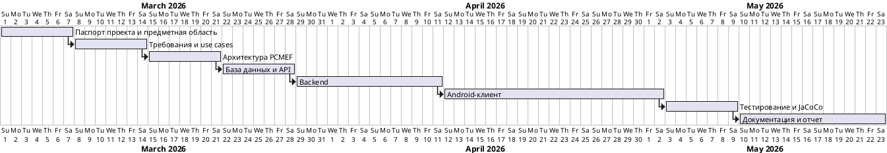

# Диаграмма Ганта

```plantuml
@startgantt
Project starts 2026-03-01
[Паспорт проекта и предметная область] lasts 7 days
[Требования и use cases] lasts 7 days
[Требования и use cases] starts at [Паспорт проекта и предметная область]'s end
[Архитектура PCMEF] lasts 7 days
[Архитектура PCMEF] starts at [Требования и use cases]'s end
[База данных и API] lasts 7 days
[База данных и API] starts at [Архитектура PCMEF]'s end
[Backend] lasts 14 days
[Backend] starts at [База данных и API]'s end
[Android-клиент] lasts 21 days
[Android-клиент] starts at [Backend]'s end
[Тестирование и JaCoCo] lasts 7 days
[Тестирование и JaCoCo] starts at [Android-клиент]'s end
[Документация и отчет] lasts 14 days
[Документация и отчет] starts at [Тестирование и JaCoCo]'s end
@endgantt
```

Диаграмма показывает учебный план работ. Фактические даты можно уточнить по истории GitHub перед сдачей.
