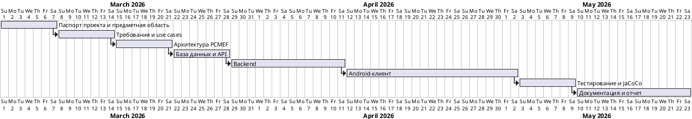
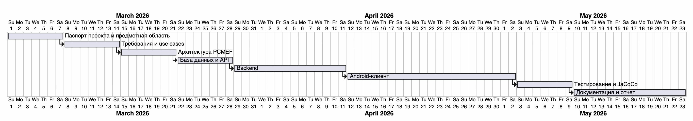

# Диаграмма Ганта

Диаграмма показывает учебный календарный план работ над Movie Collection. План начинается с паспорта проекта и анализа предметной области, затем переходит к требованиям, архитектуре PCMEF, базе данных, backend, Android-клиенту, тестированию и подготовке документации.

Этапы расположены последовательно, потому что результат каждого блока используется в следующем: требования задают основу архитектуры, архитектура определяет структуру базы данных и API, после этого реализуются backend и Android-клиент. Завершающие этапы выделены на тестирование, формирование JaCoCo-отчета и подготовку пояснительной записки.

Фактические даты можно уточнить по истории GitHub перед сдачей, но сама диаграмма фиксирует плановый порядок выполнения работ в рамках семестра.
