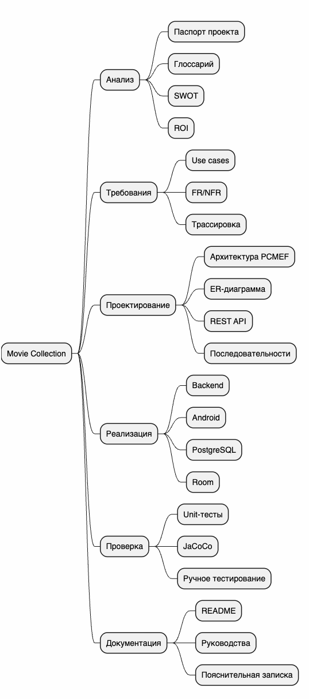

# Изображения раздела управления проектом

## Назначение

Папка содержит PNG-версии диаграмм, которые используются в разделе управления проектом и могут быть вставлены в пояснительную записку.

| Файл | Описание |
|---|---|
| [wbs.png](wbs.png) | Иерархическая структура работ Movie Collection |
| [diagram-gantt.png](diagram-gantt.png) | Календарный график выполнения проекта |

## Предпросмотр

WBS показывает разбиение проекта на анализ, требования, проектирование, реализацию, проверку и документацию.

Диаграмма Ганта показывает плановый порядок выполнения работ с марта по май 2026 года.
