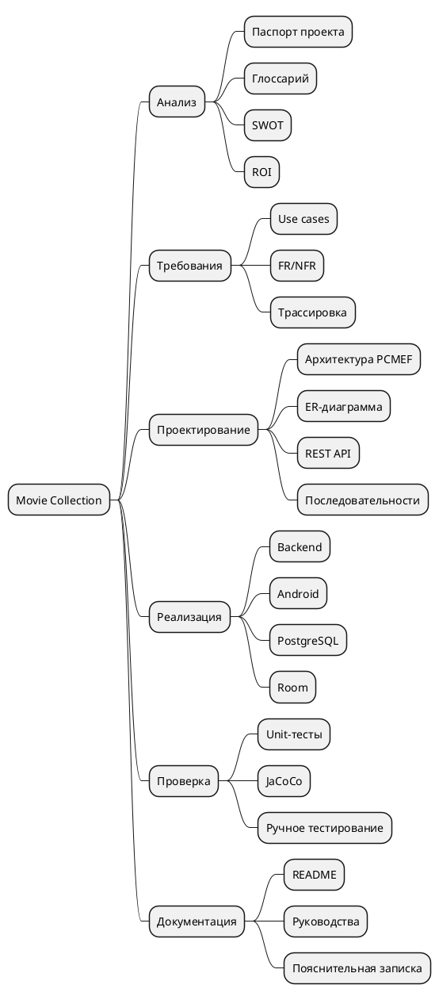

# WBS

```plantuml
@startmindmap
* Movie Collection
** Анализ
*** Паспорт проекта
*** Глоссарий
*** SWOT
*** ROI
** Требования
*** Use cases
*** FR/NFR
*** Трассировка
** Проектирование
*** Архитектура PCMEF
*** ER-диаграмма
*** REST API
*** Последовательности
** Реализация
*** Backend
*** Android
*** PostgreSQL
*** Room
** Проверка
*** Unit-тесты
*** JaCoCo
*** Ручное тестирование
** Документация
*** README
*** Руководства
*** Пояснительная записка
@endmindmap
```

WBS помогает показать, что проект выполнялся не только как код, но и как полный цикл программной инженерии.
