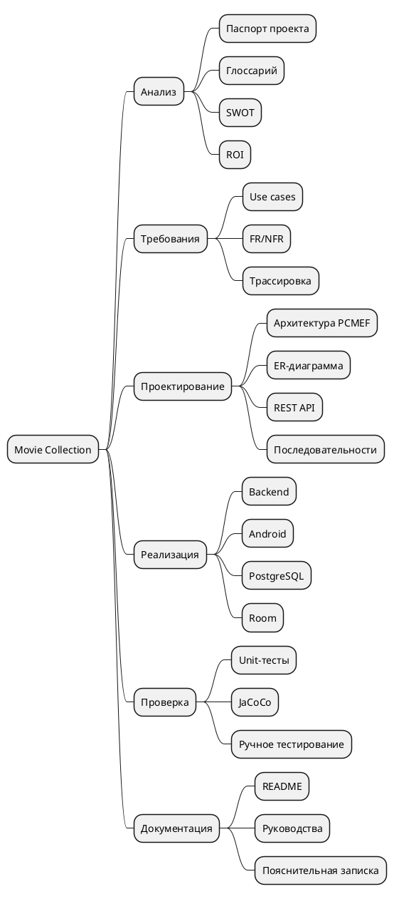

# WBS

WBS показывает декомпозицию Movie Collection на крупные блоки работ. В проект входят анализ предметной области, проектирование требований, архитектурное и детальное проектирование, реализация, проверка качества и подготовка документации.

Такая структура помогает показать, что проект выполнялся не только как код, но и как полный цикл программной инженерии. Отдельно выделены backend, Android-клиент, PostgreSQL и Room, потому что они относятся к разным частям реализации и требуют самостоятельной проверки.

Блок проверки включает unit-тесты, JaCoCo и ручное тестирование. Блок документации включает README-файлы, руководства и пояснительную записку, то есть материалы, необходимые для сдачи курсового проекта.
