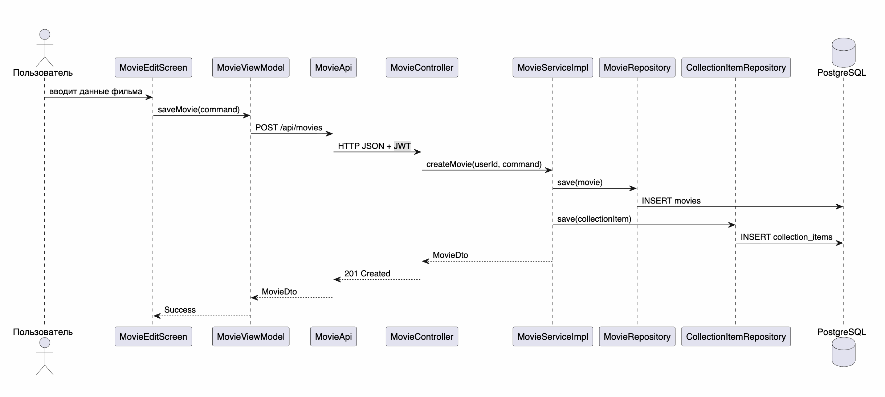

# Общие изображения для пояснительной записки

## Назначение папки

В этой папке лежат общие PNG-диаграммы, подготовленные для вставки в пояснительную записку. Они не привязаны к одному этапу документации и могут использоваться в тексте отчета как иллюстрации требований, архитектуры, базы данных и сценариев работы приложения.

## Состав изображений

| Файл | Содержание | Где лучше использовать |
|---|---|---|
| [report-use-case-diagram.png](report-use-case-diagram.png) | Диаграмма вариантов использования Movie Collection | Раздел требований |
| [report-er-diagram.png](report-er-diagram.png) | ER-диаграмма PostgreSQL | Раздел проектирования базы данных |
| [report-pcmef-architecture.png](report-pcmef-architecture.png) | Архитектура PCMEF для Android и backend | Раздел архитектуры |
| [report-create-movie-sequence.png](report-create-movie-sequence.png) | Диаграмма последовательности создания фильма | Раздел детального проектирования |
| [report-offline-cache-sequence.png](report-offline-cache-sequence.png) | Диаграмма последовательности оффлайн-режима | Раздел детального проектирования или интерфейса |

## Предпросмотр

Диаграмма показывает роли гостя, пользователя и администратора. Она помогает обосновать разделение обычных пользовательских сценариев и административных функций.

ER-диаграмма описывает структуру PostgreSQL: пользователи, фильмы, жанры и записи коллекции. Центральная таблица `collection_items` хранит персональные параметры фильма в коллекции конкретного пользователя.

Архитектурная схема показывает разделение Android-клиента и Spring Boot backend по слоям PCMEF. Она фиксирует направление зависимостей от интерфейса к контроллерам, сервисам, сущностям и репозиториям.

Диаграмма последовательности создания фильма показывает путь запроса от Android-экрана до сохранения данных в PostgreSQL через REST API и сервисный слой.

Диаграмма оффлайн-режима показывает два сценария загрузки коллекции: получение данных с backend при наличии сети и чтение последнего сохраненного состояния из Room-кэша при отсутствии соединения.

## Примечание

В Markdown-документации можно оставлять ссылки на эти изображения. В пояснительную записку Word лучше вставлять сами PNG-файлы, чтобы они корректно отображались при печати и проверке.
