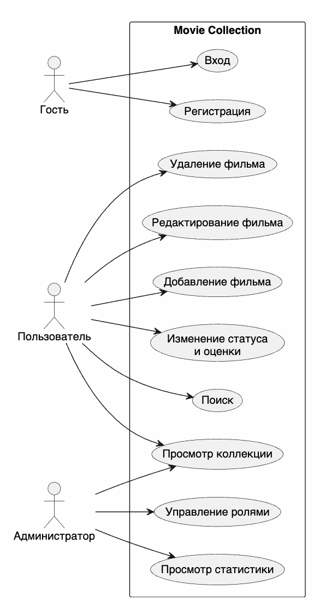
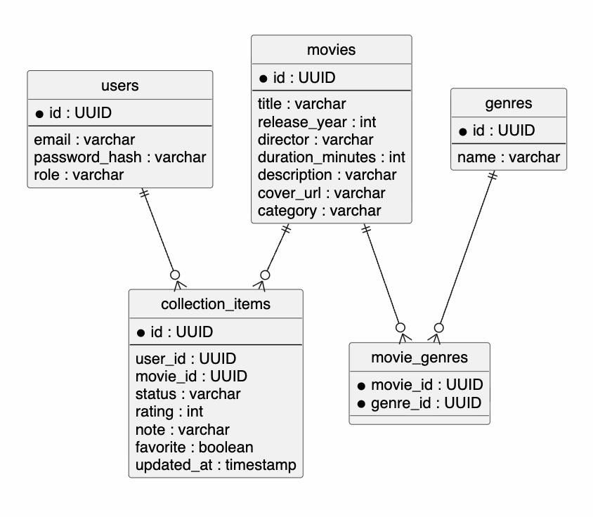
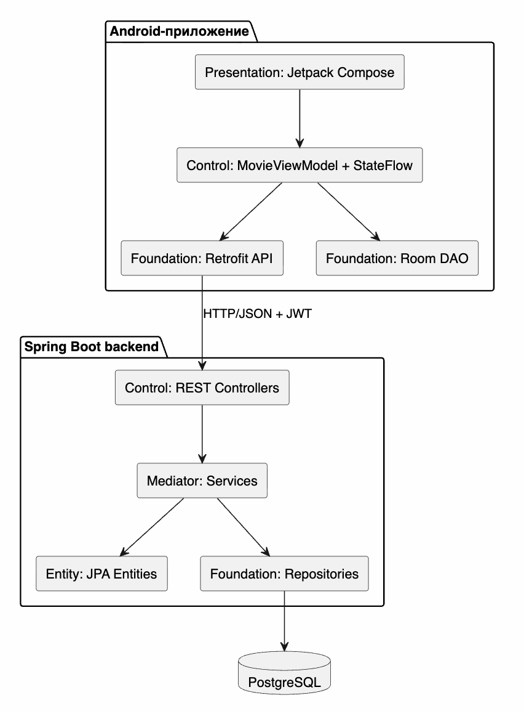

# Общие изображения документации

## Назначение папки

В этой папке собраны все PNG/JPG-изображения, которые используются в Markdown-документации и пояснительной записке. Централизация нужна, чтобы диаграммы было проще проверять, вставлять в Word-отчет и переносить между разделами без дублирования файлов.

## Состав изображений

| Файл | Содержание | Раздел |
|---|---|---|
| [authorization.png](authorization.png) | Сценарий авторизации | Детальное проектирование |
| [buc-diagram.png](buc-diagram.png) | Бизнес Use Case диаграмма | Инициация проекта |
| [business-class-model.png](business-class-model.png) | Бизнес-модель классов | Инициация проекта |
| [business-process.png](business-process.png) | Бизнес-процесс | Инициация проекта |
| [check-admin.png](check-admin.png) | Проверка роли администратора | Детальное проектирование |
| [context-diagram.png](context-diagram.png) | Контекстная диаграмма | Инициация проекта |
| [create-film.png](create-film.png) | Создание фильма | Детальное проектирование |
| [dependency-diagram.png](dependency-diagram.png) | Диаграмма зависимостей | Архитектура |
| [design-classes-diagram.png](design-classes-diagram.png) | Диаграмма проектных классов | Детальное проектирование |
| [diagram-gantt.png](diagram-gantt.png) | Диаграмма Ганта | Управление проектом |
| [domain-model.png](domain-model.png) | Модель предметной области | Требования |
| [er-diagram.png](er-diagram.png) | ER-диаграмма | База данных |
| [git-commit-activity.png](git-commit-activity.png) | Активность коммитов | Статистика разработки |
| [git-punch-card.png](git-punch-card.png) | Распределение коммитов по времени | Статистика разработки |
| [navigation.png](navigation.png) | Навигация Android-приложения | Интерфейс |
| [package-diagram.png](package-diagram.png) | Диаграмма пакетов | Архитектура |
| [pcmef-diagram.png](pcmef-diagram.png) | PCMEF-диаграмма | Архитектура |
| [report-create-movie-sequence.png](report-create-movie-sequence.png) | Последовательность создания фильма | Пояснительная записка |
| [report-er-diagram.png](report-er-diagram.png) | ER-диаграмма для отчета | Пояснительная записка |
| [report-offline-cache-sequence.png](report-offline-cache-sequence.png) | Последовательность оффлайн-режима | Пояснительная записка |
| [report-pcmef-architecture.png](report-pcmef-architecture.png) | Архитектура PCMEF для отчета | Пояснительная записка |
| [report-use-case-diagram.png](report-use-case-diagram.png) | Диаграмма вариантов использования для отчета | Пояснительная записка |
| [requirements.png](requirements.png) | Модель требований | Требования |
| [use-case-diagram.png](use-case-diagram.png) | Use Case диаграмма | Требования |
| [usecase.png](usecase.png) | Use Case диаграмма для требований | Требования |
| [wbs.png](wbs.png) | WBS | Управление проектом |

## Использование

Внутри разделов `docs` изображения подключаются относительными ссылками на `../images/...`. Для пояснительной записки Word лучше вставлять сами PNG-файлы из этой папки, чтобы они корректно отображались при печати и проверке.

## Предпросмотр ключевых диаграмм

